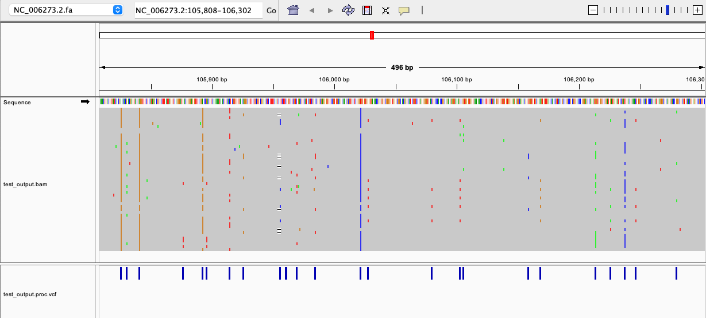

# Microorganism SNPs

Microorganism SNPs is a Python package for generating Single Nucleotide Polymorphisms (SNPs) in microorganism genomes. It provides tools for VCF calling and modification, specifically tailored for microorganism genomic data.

## Features

- VCF calling using bcftools mpileup
- Custom VCF modification and filtering
- Support for handling microorganism genomic data

## Installation

### Prerequisites

- Anaconda or Miniconda

### Steps

1. Clone the repository:

   ```
   git clone https://github.com/yourusername/microorganism_snps.git
   cd microorganism_snps
   ```

2. Create and activate the conda environment:


   ```
   conda env create -f environment.yml
   conda activate microorganism_snps
   ```

3. Install the package:


   ```
   pip install -e .
   ```

## Usage

Here's a basic example of how to use the microorganism_snps package:

```
usage: microorganism_snps.py [-h] [--inputFasta INPUTFASTA]
                             [--refGenome REFGENOME] [--wkdir WKDIR]
                             [--outputbase OUTPUTBASE] [--date DATE]
                             [--minFragSize MINFRAGSIZE] [--minDepth MINDEPTH]
                             [--minFreq MINFREQ] [--segmentSize SEGMENTSIZE]

Microorganism SNPs analysis

optional arguments:
  -h, --help            show this help message and exit
  --inputFasta INPUTFASTA
                        input fasta sequence for various strains sequences
                        (default=/dev/null).
  --refGenome REFGENOME
                        reference fasta sequence ID.
  --wkdir WKDIR         working directory
  --outputbase OUTPUTBASE
                        output name base.
  --date DATE           date, MUST in the format of '20241008'
  --minFragSize MINFRAGSIZE
                        [optional] minimum fasta sequence size (default = 50)
  --minDepth MINDEPTH   [optional] minimum depth required for variants
                        searching (default = 10)
  --minFreq MINFREQ     [optional] min alternative allele frequency (default =
                        0.05, range from 0 to 1)
  --segmentSize SEGMENTSIZE
                        [optional] segment size for long sequences (default =
                        10000)
```


## Example usage

```
python ../microorganism_snps/src/microorganism_snps/microorganism_snps.py \
    --inputFasta ../microorganism_snps/tests/cmv_50_strains.fasta \
    --refGenome NC_006273.2 \
    --outputbase test_output
```

## Visualization of example output
